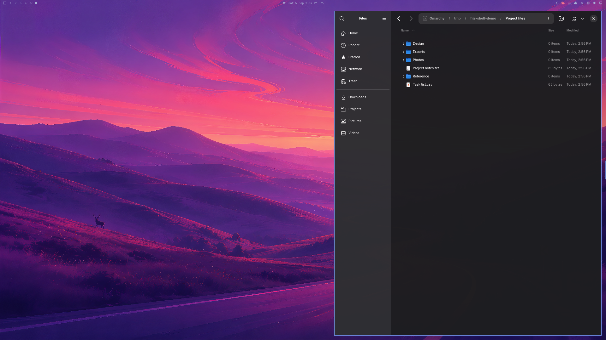
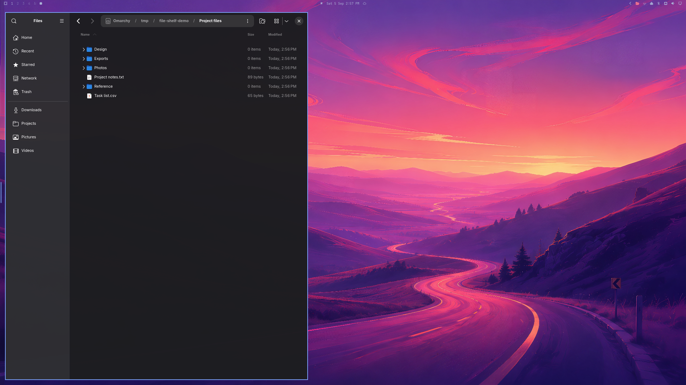
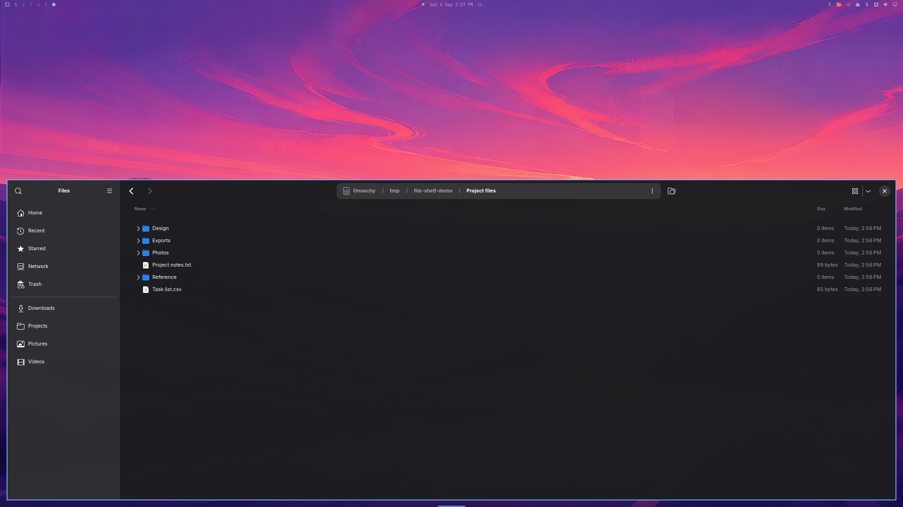

# File Shelf

Your files, one edge away.

Hover the screen edge or click the folder icon in your Omarchy bar. A real
Nautilus window opens beside your work. Find a download, browse a project,
or drag a file into another app. When you switch back to work, the shelf
retracts. Open it again and your folder and tabs are still there.



## Why install it?

- **Keep your place.** Reuse the same file-manager window instead of opening a
  fresh one every time you need a file.
- **Use familiar tools.** Nautilus provides search, tabs, previews, bookmarks,
  list and grid views, and normal copy, move, rename and trash operations.
- **Choose your layout.** Use the left, right, or bottom edge and set the shelf
  size in the bar menu or by dragging the screen edge.
- **Keep files within reach.** Open it from the menu, screen edge, or Super+E.
  Hide it with a right click or by focusing another app.
- **Work with the scratchpad.** When Omarchy's scratchpad is visible on the
  selected monitor, the shelf opens alongside it for file transfers.

No account, subscription, telemetry, or background network requests from the
plugin. Nautilus retains its normal access to your files and network locations.

## Install

Requires Omarchy 4 with its Quickshell bar, Hyprland, and Nautilus.
Tested on **Omarchy 4.0.2 and Hyprland 0.56.2**. This is an Omarchy shell plugin;
it is not a Waybar module or a GNOME extension.

```bash
omarchy plugin add https://github.com/KigoJomo/file-shelf.git --enable
```

Review and accept the CLI's confirmation. The plugin does not install packages.
While its service is running, it registers Super+E with Hyprland to toggle the
shelf. Its helper uses `hyprctl`, `jq`, `flock`, `awk`,
`busctl`, Bash, and standard coreutils. These are normally available in
Omarchy; if something is missing, the error appears in the bar icon's tooltip
and in the command-line status.

After enabling it, click the folder icon in the bar and choose Open shelf. The first launch may take
a few seconds. Subsequent opens reuse the existing Nautilus window.

The default is the **right edge of the first available monitor**. Hover that
edge for about a quarter of a second to reveal the shelf. Click the bar icon
to choose an edge and size. The selections are saved.

## Controls

| Action | Control |
| --- | --- |
| Open or retract | Super+E, right-click the bar icon, or click the edge handle |
| Reveal without clicking | Hover the selected screen edge |
| Open settings | Left-click the bar folder icon |
| Choose edge and size | Use the settings menu; drag the screen edge for a custom size |
| Retract automatically | Focus an app outside the Nautilus process |
| Use the bar with a keyboard | Focus the icon, then Enter or Space to open settings |
| Open the settings menu with a keyboard | Shift+F10 or the Menu key on the icon |
| Select a position | Tab to a button, then Enter or Space |

Nautilus dialogs and other windows belonging to the same Nautilus process keep
the shelf open. This avoids hiding it while you work in a file dialog. Clicking
the bar or edge handle still retracts it explicitly.

Super+E is registered when the plugin service loads. If you already use that
combination, change or remove the conflicting binding in your Hyprland setup.

## Pick a layout

The side shelf leaves the rest of the desktop available. This is the left-edge
layout, using the same sample folder as the opening screenshot.



The bottom layout gives you a wider file list.



Screenshots show the actual plugin on Omarchy, with sample files. Nautilus and
your desktop theme determine the appearance. The edge handle follows the
Omarchy shell theme.

## Command line

```bash
omarchy-shell file-shelf show
omarchy-shell file-shelf hide
omarchy-shell file-shelf toggle
omarchy-shell file-shelf position left
omarchy-shell file-shelf size 60
omarchy-shell file-shelf monitor HDMI-A-1
omarchy-shell file-shelf status
```

`position` accepts `left`, `bottom`, or `right`; `size` accepts 25–75 percent.
To find your monitor name, run
`hyprctl monitors`. If your chosen display is disconnected, the shelf uses an
available display and remembers your preference for when it returns.

`status` reports the last completed operation as `open`, `hidden`, `closed`, or
an `error:` message. Commands are asynchronous; give a newly launched window
time to appear before checking status. For a fresh compositor check, run
`~/.config/omarchy/plugins/kigojomo.file-shelf/bin/file-shelf-nautilus status`.

## What to expect

File Shelf manages one separate Nautilus window. It does not embed GTK inside
Quickshell, index your files, synchronize folders, or implement its own file
operations. Your other existing Nautilus windows remain separate.

- Hiding parks the window in Hyprland's `special:file-shelf` workspace. It does
  not close the window, stop a file transfer, or discard its current tabs.
- Folder context lasts as long as that Nautilus window remains open. Closing
  it or ending your desktop session means the next reveal creates a new window.
- Only one edge and one monitor are active at a time. The chosen size respects
  reserved bar space and is reapplied when you reveal or reposition the shelf.
- The selected edge reserves a narrow pointer-input strip. Choose another edge
  if it conflicts with controls you use at that boundary.
- You can open ordinary Nautilus windows while the shelf starts. File Shelf
  identifies its own request automatically and leaves those windows alone.
  There is no window picker or extra setup step.
- Like other Omarchy plugins, it runs with your user's permissions. It does not
  use elevated privileges, delete files, modify Nautilus settings, or close
  Nautilus windows. File operations you perform in Nautilus behave normally.

## Update, disable, or remove

```bash
omarchy plugin update kigojomo.file-shelf
```

To remove the shelf while keeping its Nautilus window accessible, **show it
first**, wait for it to appear, then disable or remove the plugin:

```bash
omarchy-shell file-shelf show
omarchy plugin disable kigojomo.file-shelf
# Or remove the plugin files:
omarchy plugin remove kigojomo.file-shelf
```

Disabling or removing the plugin leaves Nautilus running. If the window was
hidden, reveal its workspace with this command on Omarchy 4's Lua-based
Hyprland configuration:

```bash
hyprctl dispatch 'hl.dsp.workspace.toggle_special("file-shelf")'
```

Preferences and ownership records remain in
`${XDG_STATE_HOME:-~/.local/state}/omarchy/` as `file-shelf.json`,
`file-shelf.window`, and `file-shelf.lock`. The lock file may remain on disk;
its existence does not mean a process holds the lock.

**Upgrading from 0.3:** version 0.4 checks a compositor window tag as well as the
session and process ID. It deliberately ignores the old address-only record.
Your previous Nautilus window stays open; use the workspace command above to
retrieve it if it was hidden. The next reveal creates a newly tracked window.

## Troubleshooting

| Symptom | What to check |
| --- | --- |
| No folder icon | Run `omarchy-shell shell rescanPlugins`, allow a moment for discovery, then `omarchy plugin enable kigojomo.file-shelf`. |
| `Target not found` | Wait for plugin loading to finish. Check that the plugin is enabled and `omarchy-shell shell ping` returns `ok`. |
| Shelf does not appear | Hover the bar icon for the error, or run `omarchy-shell file-shelf status`. Check Nautilus and the helper dependencies. |
| Window disappeared after removal | Reveal `special:file-shelf` with the recovery command above. |
| Wrong display | Set the monitor with `omarchy-shell file-shelf monitor NAME`. |
| Shortcut opens ordinary Files as well | Remove the conflicting Super+E binding from your Hyprland setup. |

[Report a bug](https://github.com/KigoJomo/file-shelf/issues). Include your
Omarchy and Hyprland versions, selected edge, monitor scale, status output, and
steps to reproduce. Remove private file names from logs and screenshots.

## Development

See [development and validation](docs/development.md) for local installation,
automated tests, runtime checks, and marketplace publication.

MIT licensed. See [LICENSE](LICENSE).
